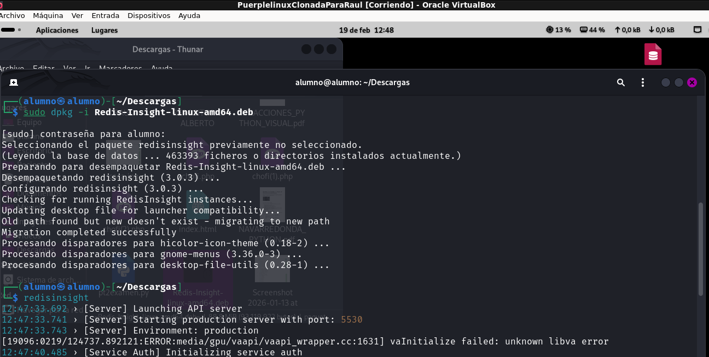
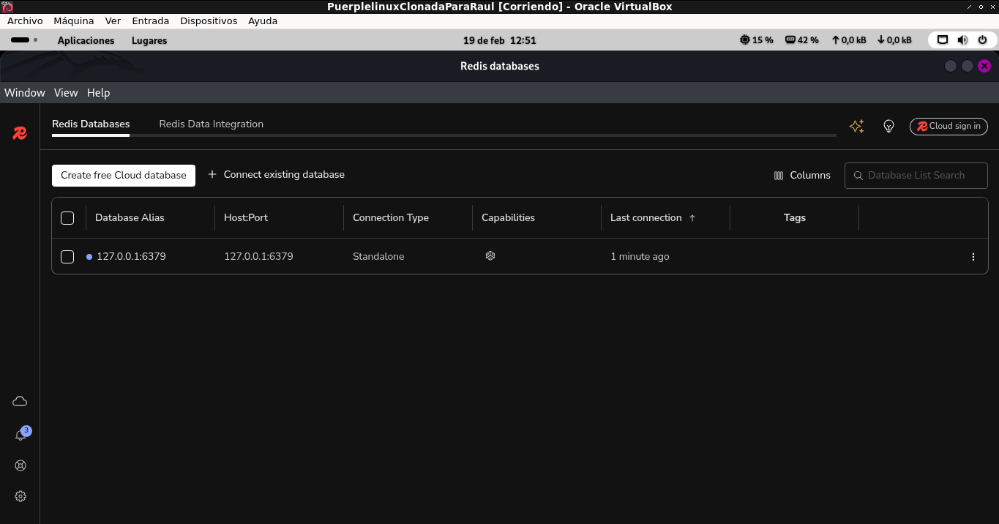
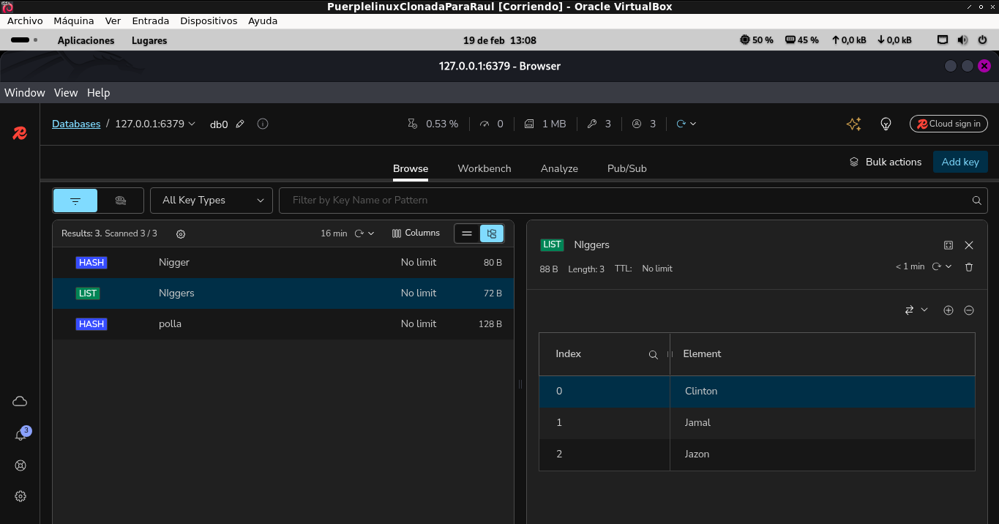
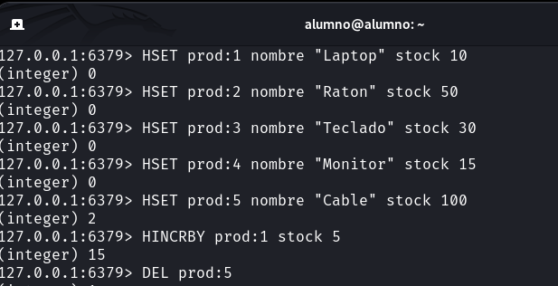
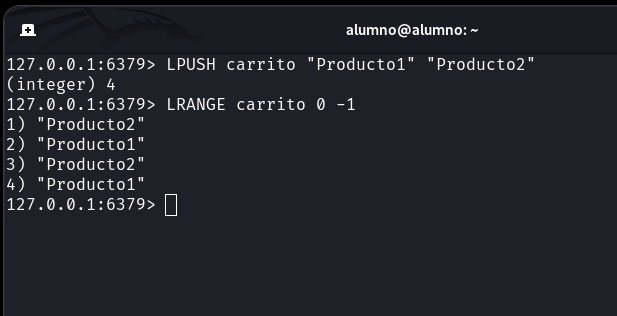
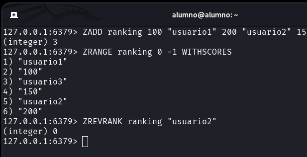
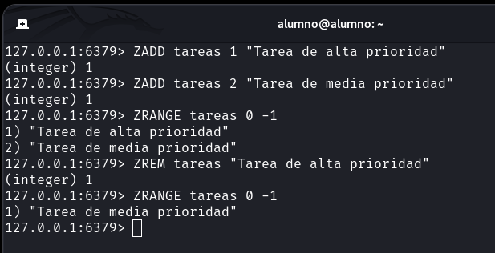

# Práctica: Implementación y Uso de Redis

## Índice
- [Instalación de Redis](#instalación-de-redis)
- [Uso de un Cliente Visual](#uso-de-un-cliente-visual)
- [Operaciones Prácticas](#operaciones-prácticas)
- [Sistema de Control de Tareas](#sistema-de-control-de-tareas)

---

## Instalación de Redis

**Descripción:** La instalación y configuración inicial de **Redis** en el sistema es el primer paso obligatorio.  
Incluye la **actualización de repositorios, instalación del servidor (`redis-server`), habilitación del servicio (`systemctl enable redis`) y la verificación de conexión (`PING`)** desde la terminal.  

---

## Uso de un Cliente Visual

**Descripción:** La instalación de **RedisInsight** integra una interfaz gráfica directamente conectada a nuestro servidor local.  
Con ella puedes **explorar claves, visualizar estructuras complejas (como hashes o sets) y monitorizar el rendimiento** sin salir del entorno visual.  

---

## Parte 4:
1. Operaciones

2. Simular un carrito de compras

3. Ranking de usuarios

4. Simulación de notificaciones

**Descripción:** Aplicación de las estructuras de Redis a casos de uso reales en el desarrollo de software.  
Incluye simulaciones para un **sistema de inventario (hashes), un carrito de compras (listas), un ranking de usuarios (conjuntos ordenados) y una cola de notificaciones (listas)**.  

---

## Parte 5:

**Descripción:** Creación de un gestor de prioridades utilizando exclusivamente **Conjuntos Ordenados (`ZADD`, `ZRANGE`, `ZREM`)**.  
Permite **añadir tareas con un nivel de prioridad numérico, consultarlas ordenadas automáticamente y marcarlas como completadas**.  