# Documentación Laboratorio DMZ con pfSense

### 1.png
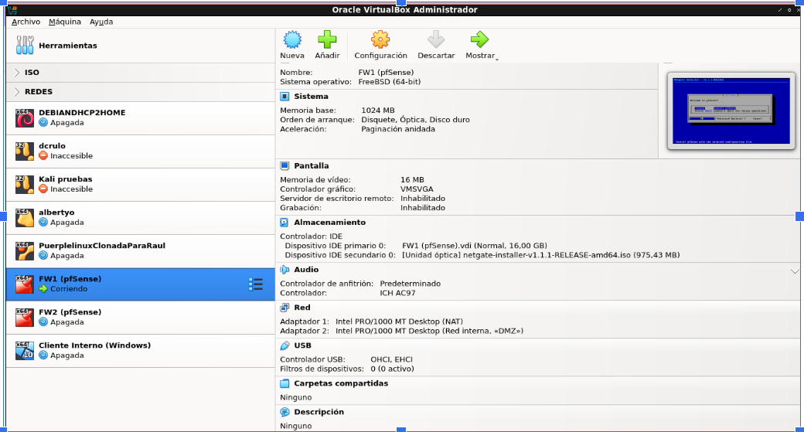
**Configuración de Red FW1 (Perímetro):**
En VirtualBox, el primer firewall (FW1) se configura con dos adaptadores para actuar como frontera:
* **Adaptador 1:** Conectado a **NAT** (para tener salida a Internet).
* **Adaptador 2:** Conectado a **Red Interna** con el nombre "DMZ". Esta red actuará como zona intermedia.

### 2.png
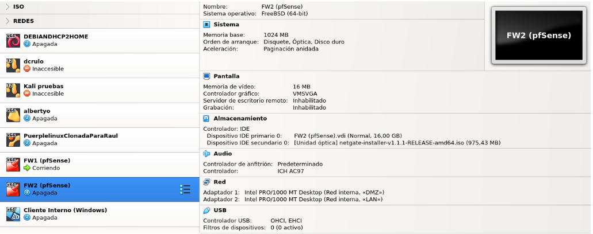
**Configuración de Red FW2 (Interno):**
El segundo firewall (FW2) protege la red interna y se conecta así:
* **Adaptador 1:** Conectado a **Red Interna** "DMZ" (para comunicarse con el FW1).
* **Adaptador 2:** Conectado a **Red Interna** "LAN" (donde estarán los equipos seguros).

### 3.png
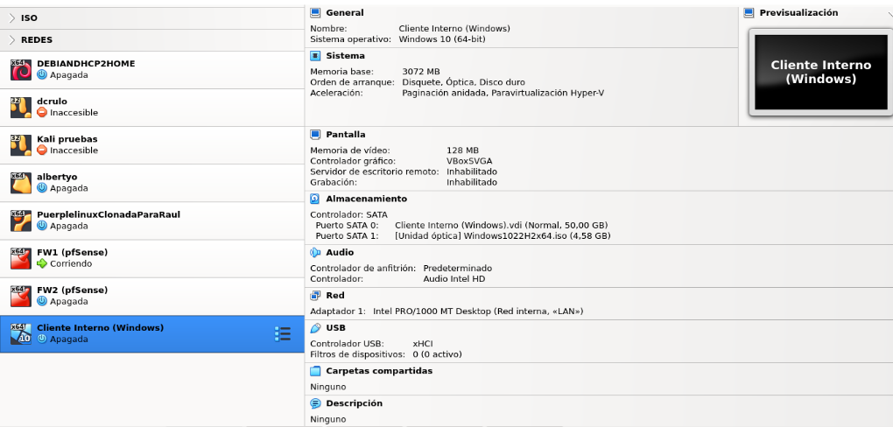
**Configuración Cliente Windows:**
La máquina virtual del cliente (Windows) se configura en **Red Interna** con el nombre "LAN". Esto la aísla totalmente de Internet directo; su única salida será a través del FW2.

### 4.png
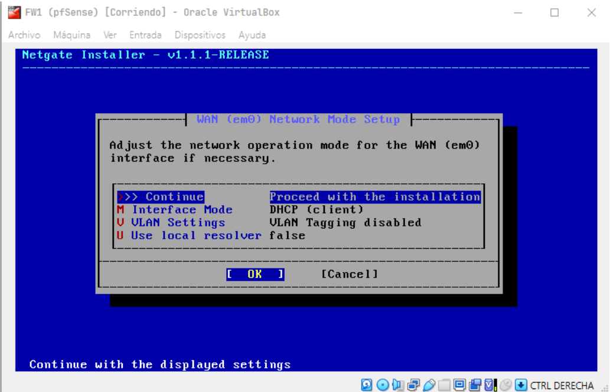
**Instalación FW1 (WAN):**
Durante la instalación del primer pfSense, se asigna la interfaz WAN para obtener IP por **DHCP** (proporcionada por el NAT de VirtualBox).

### 5.png
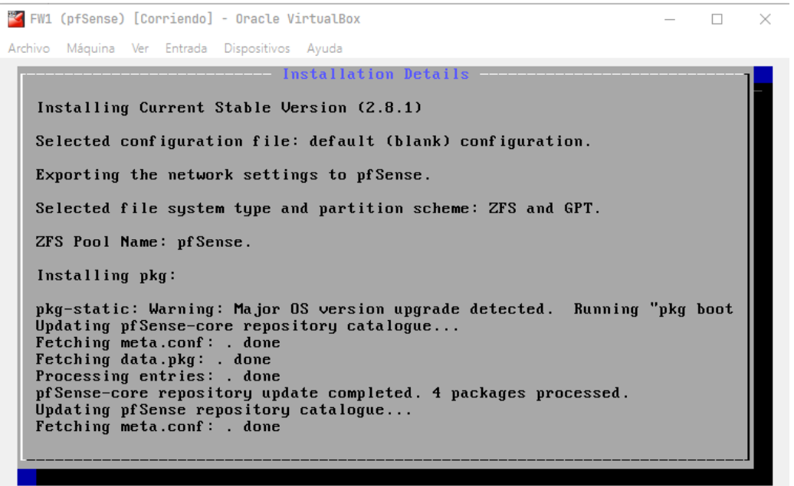
**Menú Principal FW1:**
Vista de la consola del FW1 una vez instalado:
* **WAN (em0):** Recibe IP (ej. 10.0.2.15).
* **LAN (em1):** Se configura con IP estática **192.168.1.1**. Esta interfaz alimenta la red DMZ.

### 6.png
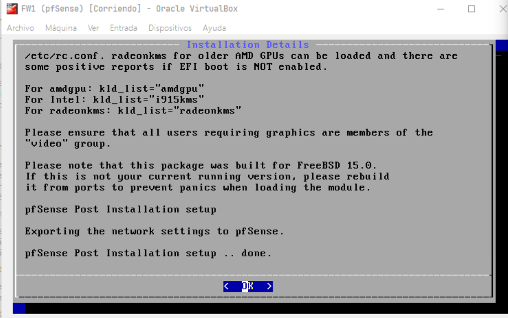
**Configuración FW2 - Interfaz WAN:**
En el segundo pfSense, configuramos su interfaz WAN de forma **Estática**:
* **IP:** 192.168.1.2 (dentro del rango de la DMZ).
* **Gateway:** 192.168.1.1 (la IP del FW1, para poder salir a Internet).

### 7.png
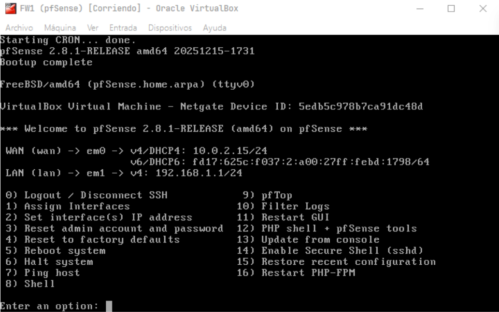
**Configuración FW2 - Interfaz LAN:**
Configuramos la interfaz LAN del FW2:
* **IP:** 192.168.0.1 (Puerta de enlace para la red segura).
* **DHCP:** Habilitado (rango .100 a .199) para dar direcciones a los clientes internos.

### 8.png
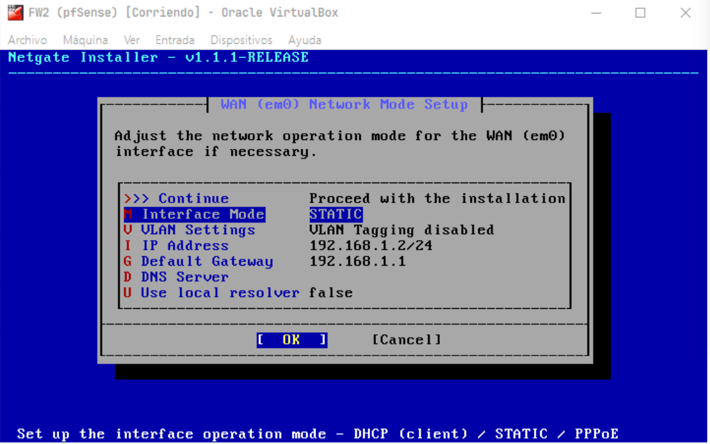
**Menú Principal FW2:**
Vista final de la consola del FW2 con sus dos interfaces operativas:
* **WAN:** 192.168.1.2 (Conectada a DMZ).
* **LAN:** 192.168.0.1 (Conectada a Red Interna).

### 9.png
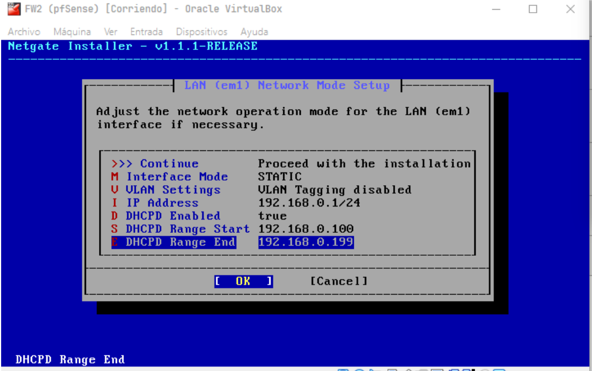
**Verificación en Cliente Windows:**
Ejecución de `ipconfig` en el cliente. Se confirma que ha recibido la IP **192.168.0.100** automáticamente desde el FW2, validando el servicio DHCP.

### 10.png
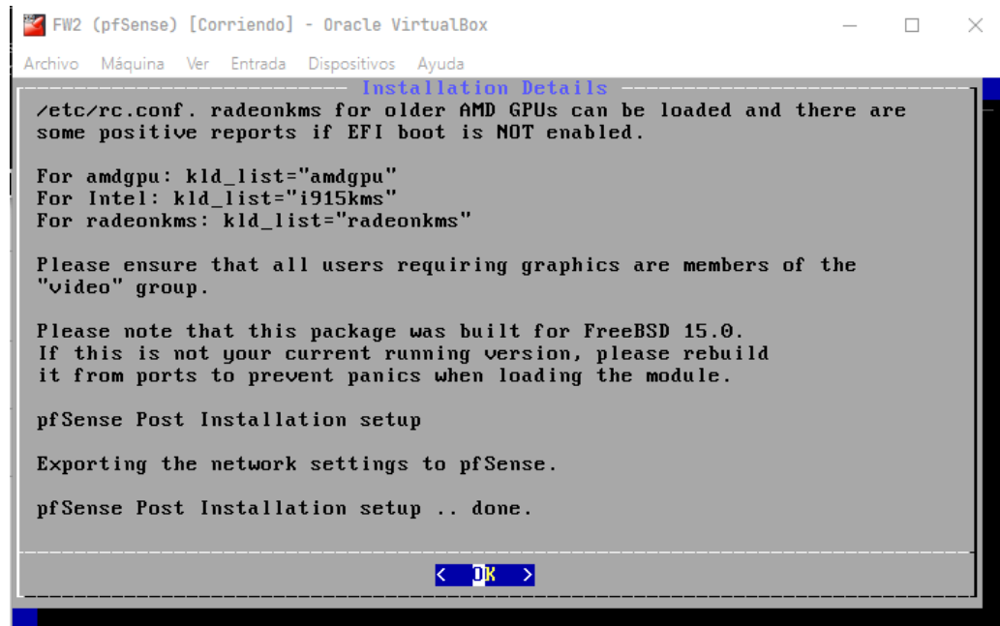
**Configuración Web - General:**
En el asistente de configuración web del FW2:
* **Hostname:** FW2
* **Domain:** home.arpa (o local)
* **DNS:** 8.8.8.8 (Google) para resolución de nombres.

### 11.png
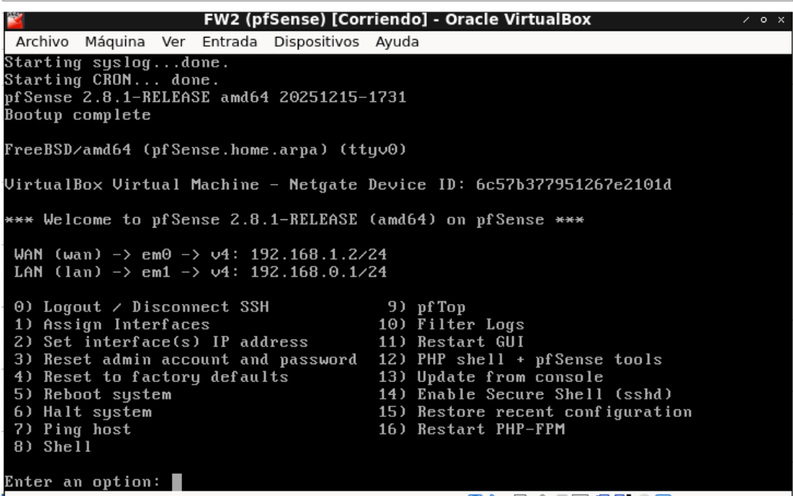
**Configuración Web - Gateway:**
Confirmación del Gateway de la WAN (**192.168.1.1**) en el asistente. Esto es crucial para que el tráfico de la red interna pueda saltar del FW2 al FW1 y luego a Internet.

### 12.png
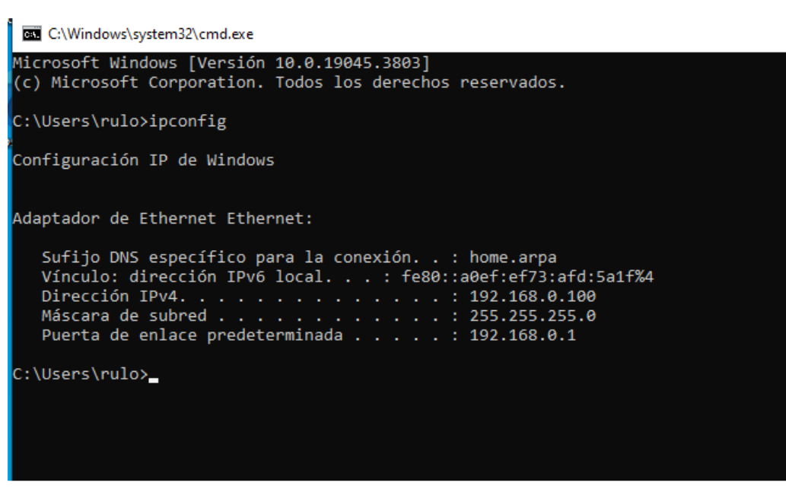
**Regla de Firewall - Ejemplo VPN:**
Creación de una regla en la interfaz WAN para permitir tráfico UDP por el puerto 1194. Esto prepararía el firewall para aceptar conexiones VPN entrantes (opcional en este laboratorio).

### 13.png
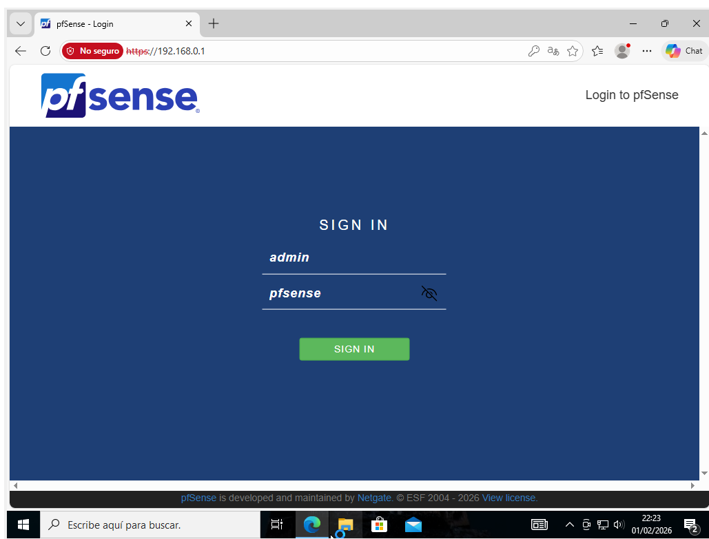
**Regla de Seguridad - Bloqueo DMZ:**
Configuración de una regla de **BLOQUEO (Block)** en la interfaz LAN.
* **Acción:** Bloquear tráfico cuyo origen sea la red DMZ (192.168.1.0/24) hacia la LAN. Esto evita que si hackean un servidor en la DMZ, puedan saltar a la red interna.

### 14.png
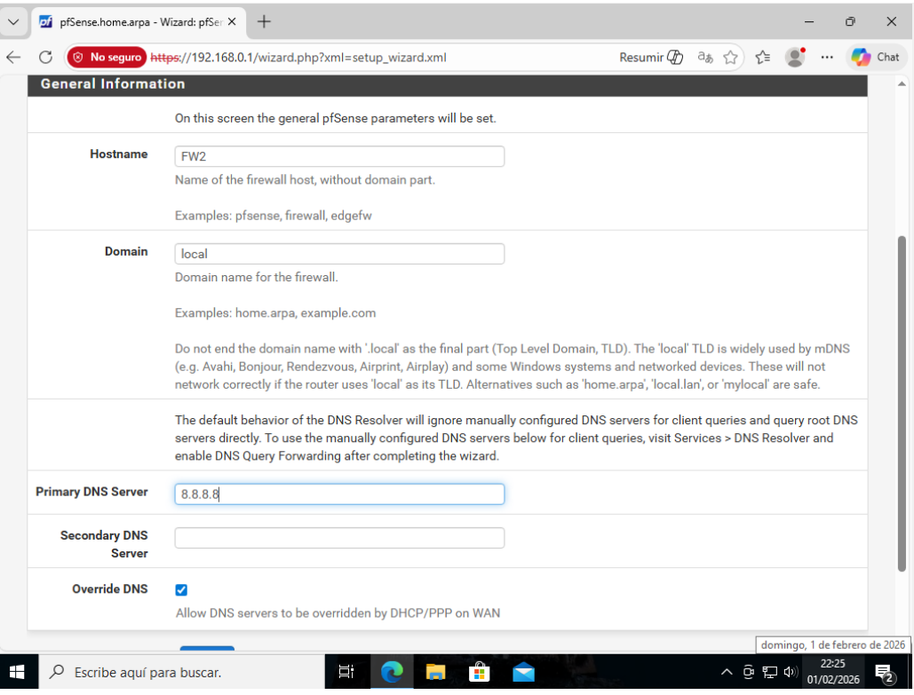
**Resumen de Reglas:**
Tabla final de reglas en el firewall. Se observa la regla predeterminada "Anti-Lockout" y las reglas personalizadas de bloqueo y permiso aplicadas.

### 15.png
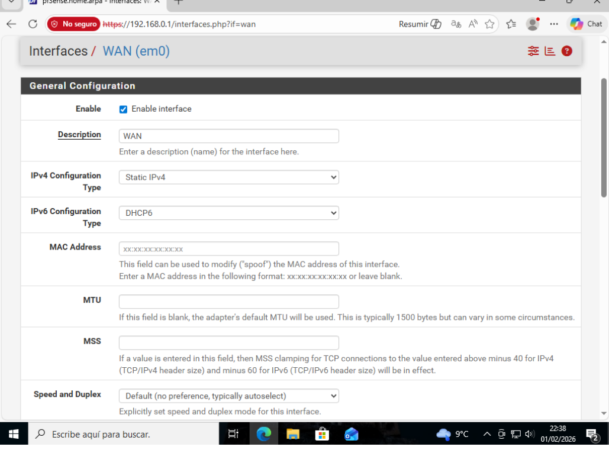
**Prueba Final de Conectividad:**
Prueba desde Windows con `ping 8.8.8.8` (exitoso) y `tracert 8.8.8.8`. Se visualiza el doble salto:
1.  **192.168.0.1** (Paso por FW2).
2.  **192.168.1.1** (Paso por FW1).
3.  Salida a Internet.
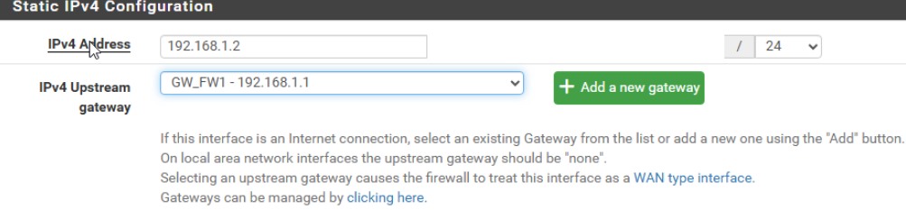
